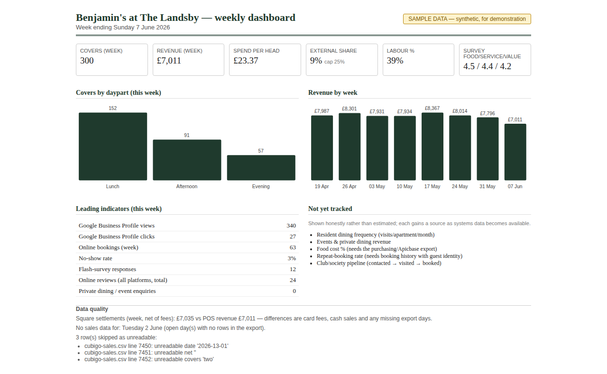

# Benjamin's at The Landsby — Restaurant Manager Application

**A 12-month plan to make Benjamin's the social heart of The Landsby and a known neighbourhood destination in Stanmore — low capital, residents first, every decision tested against data.**

Prepared by **Vasile Bogdan Godja** · godjabogdan@gmail.com · June 2026

---

## The documents

| Document | What it is |
|---|---|
| **[One-page summary (PDF)](Benjamins-Plan-OnePager.pdf)** | The plan at a glance — start here |
| **[The full 12-month plan](Benjamins-Restaurant-Manager-Plan.md)** | Five pillars, a concrete first 90 days, the financial model with pre-agreed success gates, KPIs, resident-protection rules and compliance |
| **[Research base](Benjamins-Research-Base.md)** | The evidence behind the plan: Stanmore demographics, the competitive landscape, menu and pricing benchmarks |
| **[Automation portfolio](Benjamins-Automation-Portfolio.md)** | The internal tools I would build personally, at no software cost — what each reads and produces, estimated build effort, and sequencing against the 90-day plan |

## The plan in brief

Benjamin's is a genuinely good restaurant trading below its potential: a 5.0-rated "hidden gem" inside a near-fully-occupied luxury later-living community, in one of outer London's most affluent suburbs — yet closed on Sundays, with almost no digital footprint. The plan proposes a phased, low-capital programme across five pillars: **visibility**, **operational efficiency**, **service and food quality**, **training and team development**, and **data-driven decisions**.

The guiding principle throughout is **residents first** — every external-revenue initiative is designed to enhance, never dilute, the resident experience. Every pilot carries pre-agreed success gates and a stop-or-scale decision made on evidence; no pilot becomes permanent by default.

## A working demonstration

Pillar 5 commits to one weekly dashboard built from the systems the group already owns (Cubigo, Apicbase, Monika, Square). Rather than promise it, I built it:



All data is synthetic, clearly watermarked, and generated to match the plan's stated planning assumptions. The page discloses its own data quality — unreadable rows, missing export days and settlement differences are listed in the footer, never hidden — because trustworthy reporting is the whole point.

Run it on any machine with Python 3, no installations:

```
cd demo/weekly-dashboard
python3 build_dashboard.py              # rebuilds dashboard.html from the CSV exports
python3 -m unittest test_dashboard -v   # 37 tests, incl. an independent recount of every headline figure
```

It is built to the rules set out in the [Automation Portfolio](Benjamins-Automation-Portfolio.md): deterministic scripts over AI, ordinary CSV exports in and one page out, Python standard library only, exportable to any other Elysian–Audley site by copying a folder and editing one configuration file.

---

*Benjamin's at The Landsby · Merrion Avenue, Stanmore HA7 · This repository accompanies a Restaurant Manager application; full sources for the research base are available on request.*
